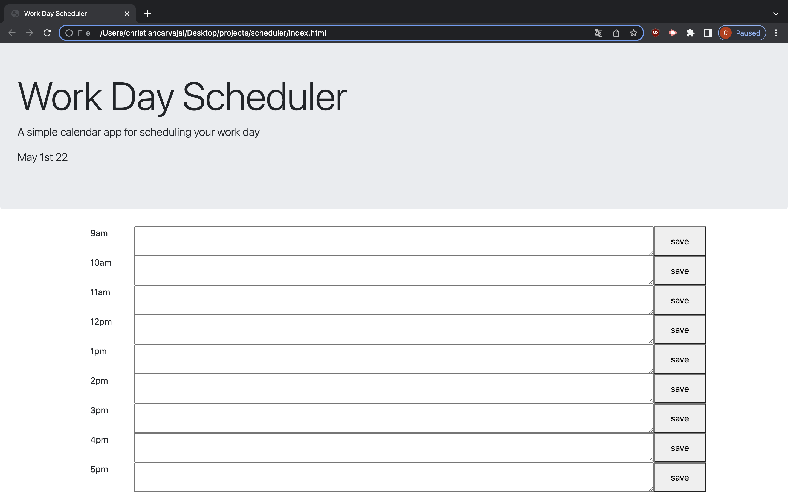

# Work Day Scheduler Starter Code
## purpose
A work day scheduler application. Tasks are saved into local storage on the click of the save button. Color of task changes depending on the time and state of task.

## built with
* html
* css
* javascript
* jquery
* bootstap 

## webstite
https://chriscarv.github.io/workday-scheduler/

